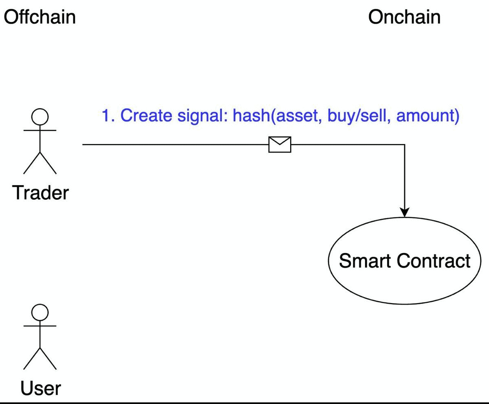

# Proof Of Trade
Zero knowledge proving system for historical performance of trader.

Build for [Solana Ignition Hackathon](https://solana.com/ignition).
## What is it
One of the most common use cases of cryptocurrency is trading. There are a lot of traders which offer their service - education, signals or delegate trading. How can a person without any trading skills distinguish real professionals from scammers and bull market gurus?

Historical performance is the only reliable metric. So a method of trade performance proving is needed. It should be trustless - is builded on blockchain to achieve this. It should be private as traders don't want to reveal their trading activity - zero knowledge proof is used to achieve it.

## How it works
There are two parties: traders and users.

    

Trader path:
1. They register on the platform with their login, blockchain address and contact information. 
2. After that they can create trade signals. Trade data (ticker, amount, trade direction and nonce) is inserted by the trader, all this data is concatenated and hashed. Resulting hash is stored on the blockchain with an associated timestamp.
3. They make such signals during a month (or any other period) and can create trading performance proof at the end of period. They insert all signals preimage data (ticker, amount, trade direction and nonce - private inputs of SNARK). Local frontend downloads signals' hashes and actives' prices on associated timestamps from blockchain (public inputs of SNARK). After that, the frontend calculates zero knowledge proof of period trade performance with performance percent (output of SNARK). Proof and percent are stored on blockchain too.

User can:
- view list of traders and their performance percents
- verify all percents by checking zk-proof locally on their browser
- chouse trader with the desired ratio of profits and risks
- contact with traders in order to buy their service

External observers don't understand which signals a trader has made - it is private. All signals’ data are stored on a chain and reliable cryptography is used for performance proving - it is trustless.

## Technical details
[Solana](https://solana.com/) smart contracts are used as backend. All functionality and data are stored in the Solana blockchain.

Zk part of the project is implemented using [circom](https://github.com/iden3/circom) and [wasmsnark](https://github.com/iden3/wasmsnark) libraries. These libraries generate wasm prover and verifier which allow generating and verifying proofs in web browser effectively. As proofs are generated and verified off chain it is free.

Client is the static web page which connects with the Solana blockchain using [Phantom](https://phantom.app/).

[Pyth](https://pyth.network/) onchain oracle is used as market data source.